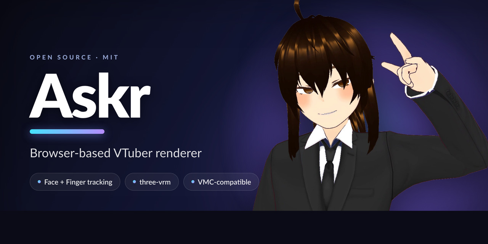

# Ultraleap Gemini (LeapC) を Python から叩いて、ブラウザの VRM を指まで動かす

<p align="center">
  
</p>

顔と手/指のトラッキングを取り込んで、VRM アバターを**ブラウザ上で**動かす VTuber レンダラ
[**Askr**](https://github.com/AideaHandesen-dvs/askr) を作った。この記事は、その中で
**一番情報が少なくて詰まりやすかった「現行 Ultraleap (Gemini / LeapC) を自作パイプラインに
持ち込む」部分**を中心に、全体構成ごとまとめたもの。

結論を先に言うと:

- Leap の手/指は **LeapC（現行ネイティブ C API）を公式 Python bindings 経由で直接叩く**のが正解。
  世に溢れてる旧 WebSocket API (`ws://127.0.0.1:6437`) は **Gemini で廃止済み**。
- 一番の罠は **同梱 binding の ABI が Python 3.12 固定**なこと。コンパイラ無しで通すには
  **隔離した Python 3.12 をフォルダで持ち込む**。
- 指ボーンのローカル回転計算には **実機 VRM の rest pose が要る**ので、リターゲットは
  撮影 PC ではなく **VRM を持つブラウザ (three-vrm) 側**でやる。撮影 PC は「読んで投げるだけ」。

コードは全部 MIT で公開してある → https://github.com/AideaHandesen-dvs/askr

---

## 何を作ったか

- **入力**: 顔 = iFacialMocap（iPhone）、手/腕/指 = Ultraleap（Gemini / LeapC）
- **描画**: [three-vrm](https://github.com/pixiv/three-vrm) で VRM アバターを**ブラウザ**で描く
- **出力**: OBS のブラウザソース（背景透過 α）でそのまま取り込む
- VMC 互換。全調整はブラウザ上のパネルで完結し `config.json` に永続化

「フルオープンで全部いじれる軽量レンダラ」が欲しくて、ブラウザ完結・生データ直結・スタックを
丸ごと自分で握れる構成にした。

---

## 全体構成

顔と手は**独立した経路**で流す。どちらも撮影 PC 側は薄い送信器で、生データを UDP で
レンダーホストへ投げるだけ。レンダーホスト側の細い bridge が UDP を WebSocket に橋渡しし、
ブラウザがそれを受けて描画する。

```
  ┌─────────── 撮影PC ───────────┐        ┌──────────────── レンダーホスト ────────────────┐
  │  iFacialMocap ─┐             │        │  raw_ifm_ws_bridge.py  :49985 → WS :8201        │
  │                ├ ifm_forward.py ──UDP─┼─▶                                              │
  │                │  :49984      │        │  leap_raw_ws_bridge.py :49986 → WS :8202        │
  │  Leap(LeapC) ─ leap_send.py ──UDP──────┼─▶                                              │
  │                              │        │  config_server.py :8199  (index.html + /config) │
  └──────────────────────────────┘        │           │                                    │
                                           │           ▼   ブラウザ (three-vrm renderer)     │
                                           │   http://<host>:8199   WS:8201(顔)/8202(手)受信 │
                                           └───────────────────────┬────────────────────────┘
                                                                    ▼
                                        OBS ブラウザソース (?clean=1, 背景透過α) ──▶ 配信/合成
```

なぜこの分割かというと、**リターゲット（Leap の関節座標 → VRM の指/腕ボーンのローカル回転）を
ブラウザ側に寄せたい**から。指ボーンのローカル回転を出すには、その VRM の rest pose（初期姿勢）が
要る。VRM を持ってるのはブラウザなので、そこで回すのが素直。撮影 PC 側に VRM を持たせて回すと、
モデルを替えるたびに撮影 PC も更新する羽目になる。だから撮影 PC は「Leap を読んで JSON にして
投げるだけ」に徹する。

---

## 本題：現行 Leap (Gemini / LeapC) を Python に持ち込む

### なぜここが難所なのか

ネットに転がってる Leap のサンプルは**ほぼ全部が旧世代の WebSocket API**
（`ws://127.0.0.1:6437/v6.json`）を使ってる。これは Leap Motion v2 〜 Orion 時代のもので、
現行の **Ultraleap "Gemini" (v5) ではこの WebSocket は廃止済み**。古い記事や学習データの
化石 API をなぞると「繋がらない → 詰み」になる。

> ちなみに "Gemini" は Ultraleap のトラッキングソフトの世代名で、Google の Gemini とは無関係。

正解は **LeapC（現行のネイティブ C API）を公式 Python bindings 経由で直接叩く**こと。

### 前提（Windows 実機）

- トラッキングサービス（`UltraleapTracking` / `LeapSvc.exe`）が動いている
- SDK: `<Ultraleap>\LeapSDK\`（`LeapC.h` / `lib\x64\LeapC.dll` / `samples\*.c`）
- 低レベル Python binding: `LeapSDK\leapc_cffi\`
  - ここに **`_leapc_cffi.cp312-win_amd64.pyd` が同梱** ＝ **Python 3.12 用にビルド済み**

### 最大の罠：ABI が Python 3.12 固定

同梱 binding は **cp312（CPython 3.12 ABI）**でビルドされている。手元の Python が 3.13 等だと
そのままでは **import できない**。かといってコンパイラが無い環境では「3.13 用に再ビルド」も
「C サンプルのコンパイル」も無理。

→ 詰まないための唯一のコンパイラ不要ルートは、**cp312 に ABI を合わせる＝隔離した Python 3.12 を
持ち込む**こと。

### 持ち込み手順（インストール不要・フォルダで完結）

専用フォルダ（例 `<install-dir>\leap312\`）に隔離環境を作る。フォルダ削除で原状復帰でき、
git 対象外にもできる。

1. **embeddable Python 3.12.x**（インストーラ不要の zip）を `<install-dir>\leap312\` へ展開
2. `python312._pth` を編集して site-packages を有効化
   （`python312.zip` / `.` / `Lib\site-packages` / `import site` を有効に）
3. `get-pip.py` で pip を bootstrap
4. `python.exe -m pip install cffi numpy`（**wheel のみ・コンパイル無し**）
5. SDK の `LeapSDK\leapc_cffi` を `Lib\site-packages\leapc_cffi` へ丸ごとコピー
   （cp312 の `.pyd` と `LeapC.dll` ごと）
6. GitHub [`ultraleap/leapc-python-bindings`](https://github.com/ultraleap/leapc-python-bindings) の
   **純 Python 高レベルパッケージ `leap`**（`leapc-python-api/src/leap`）を
   `Lib\site-packages\leap` へコピー（ビルド不要）
7. 疎通確認：`import leapc_cffi` → `ffi/libleapc` OK、`import leap` OK

### 疎通確認

```python
import leap

class P(leap.Listener):
    def on_tracking_event(self, e):
        print("hands:", len(e.hands))

conn = leap.Connection()
conn.add_listener(P())
with conn.open():
    conn.set_tracking_mode(leap.TrackingMode.Desktop)
    ...
```

`leap.Connection().open()` でトラッキングサービスに接続すると、フレームが連続で流入する。
手をかざすと **全指スケルトン**（5 指 × 4 ボーンの 3D 関節座標・palm・grab/pinch）が取れる。
`hand.arm.prev_joint`（肘）/ `hand.arm.next_joint`（手首）/ `hand.arm.rotation`（前腕 quat）も。

### 座標系の注意

Leap は **右手系・mm・X 右 / Y 上 / Z 手前（ユーザ方向）**。VRM / Unity は左手系・Z 奥なので
変換が要る。Askr では位置ベースでリターゲットするので、この符号変換は
**renderer(JS) 側の一箇所に集約**している（あちこちに散らすとデバッグ地獄になる）。

### 小物ハマり

- `event.device.get_info()` が空例外でシリアルを取れないことがある（**トラッキングには不要・実害なし**）
- SSH 越しの Windows コンソールは cp1252 になり、日本語やシリアルで `UnicodeEncodeError`。
  `sys.stdout.reconfigure(encoding="utf-8", errors="replace")` で回避

---

## 撮影 PC → レンダーホストのワイヤ形式

送信器（`leap_send.py`）は LeapC の `on_tracking_event` の中で、必要な値だけ抜いて
1 フレーム 1 UDP パケットで投げる。**座標変換もリターゲットもここではやらない**（全部 JS 側）。

JSON はこんな形（mm・右手系のまま）:

```jsonc
{"t": <frame_id>,
 "h": [ {"s": "l"|"r",                              // hand type
         "p": [x,y,z], "q": [x,y,z,w],              // palm 位置 / 向き(quat)
         "g": grab, "pn": pinch,                    // 握り/つまみ 0..1
         "a": {"e":[x,y,z], "w":[x,y,z], "q":[x,y,z,w]},  // arm: elbow / wrist / 前腕quat
         "d": [ [j0,j1,j2,j3,j4], ... x5 ] }        // digit毎に 5関節位置(親→指先)
      ] }
```

手が無いフレームは `"h": []`。ブラウザ側は手ロストで rest（初期姿勢）へ戻す。

指の 5 関節は Leap の `digit.bones[0..3]`（metacarpal / proximal / intermediate / distal）から、
`bone0.prev, bone0.next, bone1.next, bone2.next, bone3.next`（＝親 → 指先）で拾う。

**帯域を絞る小技**: 位置は 0.1mm 精度（小数第 1 位）、quat は小数第 4 位に丸めてから JSON 化する。
トラッキング品質は体感変わらず、パケットはかなり軽くなる。60fps でだらだら流れる用途だと効く。

```python
def r1(v): return round(v, 1)   # mm は 0.1mm で十分
def r4(v): return round(v, 4)   # quat
```

---

## ブラウザ側：生データを VRM に載せる

前述の通り、リターゲットは three-vrm を持つブラウザ側でやる。ポイントだけ:

- **rest pose 基準のローカル回転**で指/腕ボーンを回す。VRM ごとに初期姿勢が違うので、
  実機の VRM から rest を取って基準にする。
- Leap → three の**符号変換は一箇所**に集約。
- 手ロスト時は rest へ戻す。生データがカクついても破綻しないよう、受け側で smoothing を噛ませる。

顔（iFacialMocap）は別経路の生テキストを WebSocket で受けて、blendshape に流し込む。手と顔が
独立してるので、片方だけ使う（顔だけ / 手だけ）構成も素直に組める。

---

## 出力：OBS ブラウザソース（背景透過）

- OBS の**ブラウザソース**に `http://<レンダーホスト>:8199/?clean=1` を指定
  - `?clean=1` で HUD・診断ドット・Leap デバッグ球を**全消し**（＝アバターだけのクリーン映像）
  - **背景透過は renderer が α 対応**。OBS ブラウザソースのアルファでそのまま抜ける
    （**クロマキー不要**）
- これで OBS に取り込めた＝あとは普段どおり配信・録画・合成すればいい（NDI 等の配信手段は各自の環境次第＝Askr は OBS のブラウザソースまでで完結）

---

## 既知の限界

- **前腕のねじれ（ソーセージ化）**: VRoid 由来の VRM は**ツイスト骨を持たない**ため、前腕の
  回内/回外が単一の骨に集中してメッシュが巻きつく。Askr ではひねりを前腕/手へ配分＋肘下げ
  バイアスで**軽減**しているが、**完全解消には Blender 等でツイスト骨を足す**必要がある。
- **Leap の肘推定**はデバイス FOV 外だと甘い。単眼 Leap なので可動範囲にも限界がある。
- 顔は iFacialMocap（iPhone 等）前提。

---

## まとめ

- 現行 Leap を自作パイプラインに繋ぐなら、**旧 WebSocket API は忘れて LeapC + Python bindings**。
- 詰みポイントは **cp312 ABI 固定** → **隔離 Python 3.12 をフォルダで持ち込む**。
- リターゲットは **VRM を持つ側（ブラウザ）**でやると、モデル差し替えが楽。
- 撮影 PC は「読んで丸めて UDP で投げるだけ」に徹すると全体が薄く保てる。

コード・詳細手順・サンプル VRM 同梱で全部公開してある。動かしてみたい人はどうぞ:

**→ https://github.com/AideaHandesen-dvs/askr**（MIT）

Leap 持ち込みの詳細だけ読みたい人はこちら:
[docs/leap-gemini-bringup.md](https://github.com/AideaHandesen-dvs/askr/blob/main/docs/leap-gemini-bringup.md)
